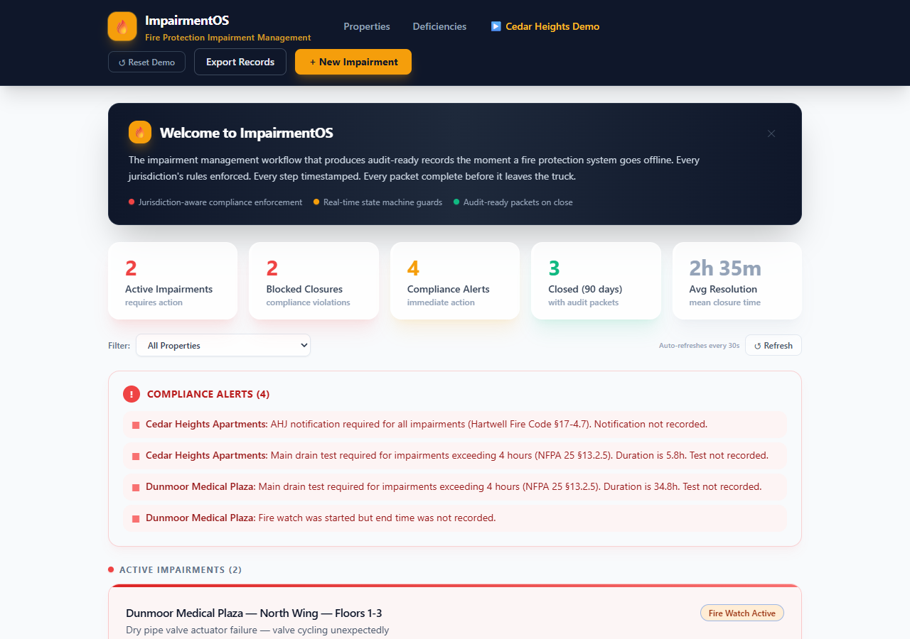
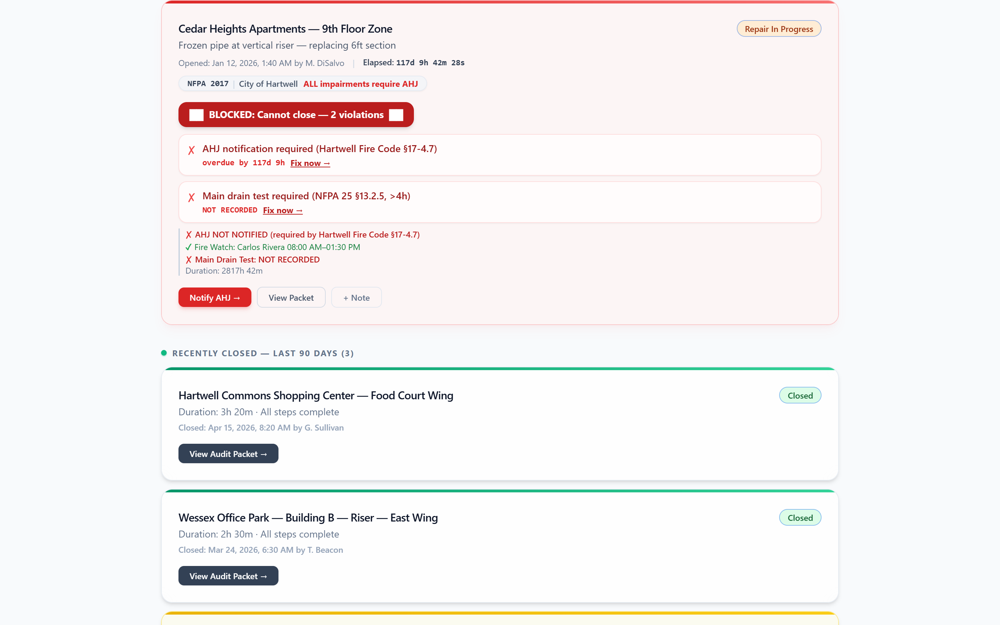
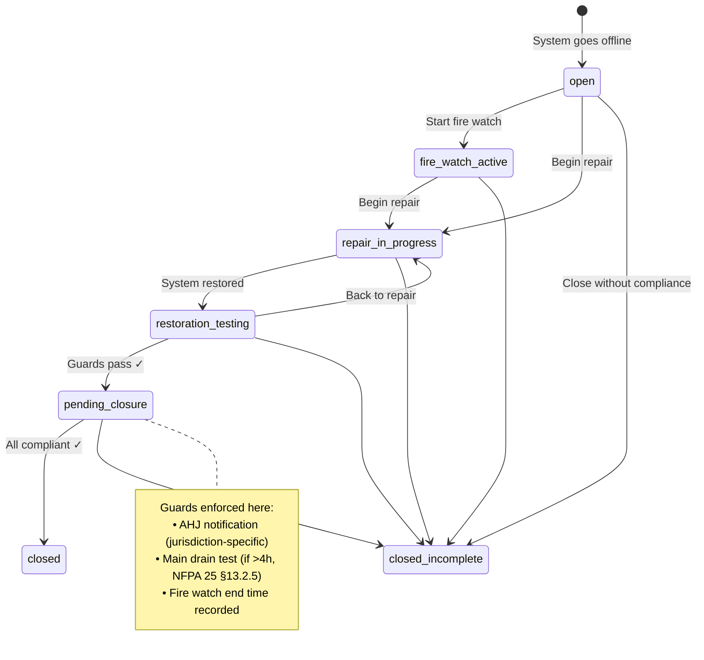
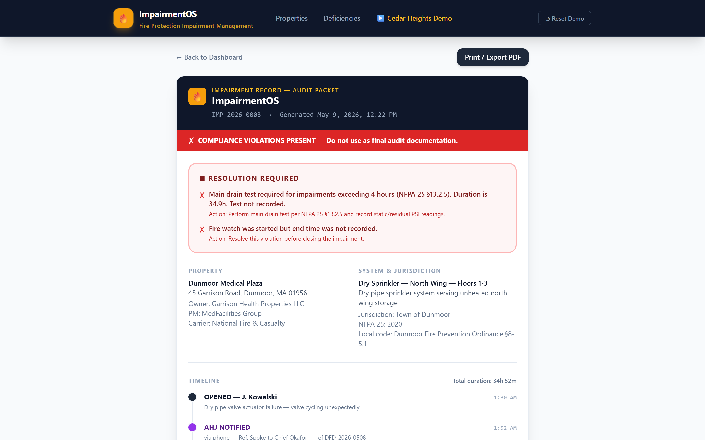
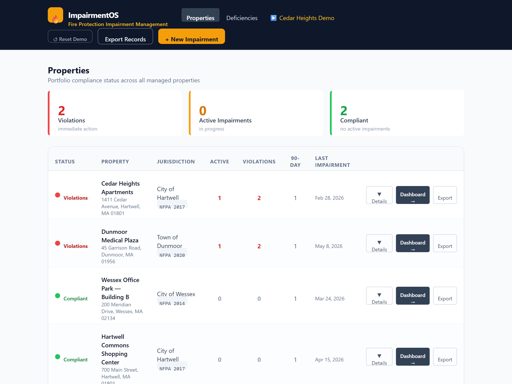
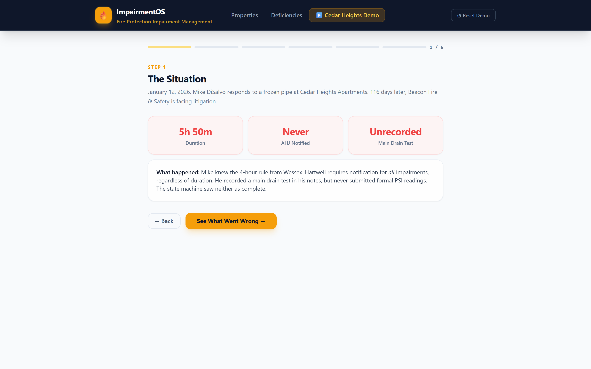
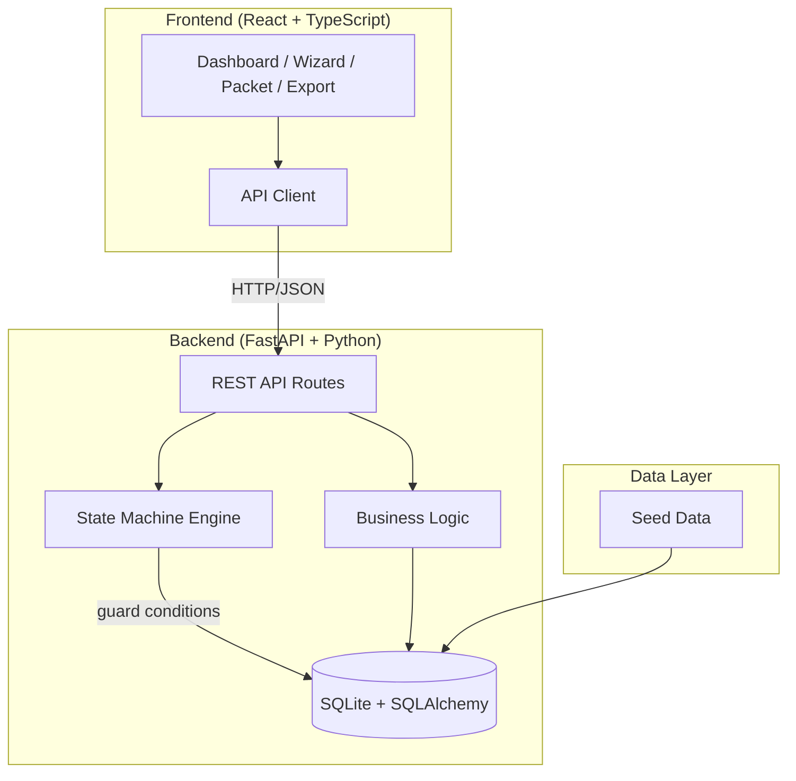

# ImpairmentOS

**When a fire suppression system goes offline, the paperwork decides the lawsuit.**

ImpairmentOS is an impairment management system for fire protection contractors. It enforces jurisdiction-specific compliance rules through a state machine — so the only way to close an impairment is the compliant way. The audit-ready documentation is a byproduct of doing the work, not an afterthought reconstructed months later.



---

## The Problem

A fire protection contractor manages dozens of properties across multiple jurisdictions. Each jurisdiction has different rules:

- **Hartwell** requires AHJ notification for *all* impairments, regardless of duration
- **Wessex** only requires notification after 4 hours
- **Dunmoor** requires notification within 30 minutes

A technician who knows the Wessex rules might skip the AHJ call on a Hartwell job — and nobody catches it until a fire marshal, insurance carrier, or attorney demands documentation that doesn't exist.

That's what happened at Cedar Heights. A frozen pipe was repaired in under 6 hours. The technician did good work. But because the AHJ was never notified (he applied the wrong jurisdiction's threshold) and the main drain test was never formally recorded, the contractor faced litigation 116 days later when four different parties demanded records.

## The Solution

ImpairmentOS makes it impossible to close an impairment without satisfying every jurisdiction-specific requirement. It doesn't warn — it **blocks**.



### How It Works

Every impairment moves through a state machine. Guard conditions check the jurisdiction's rules before allowing each transition. If AHJ notification is required and hasn't been recorded, the transition to `closed` is rejected with a specific error message citing the local fire code.



### Guard Conditions

The state machine checks three things before allowing closure:

| Guard | Condition | Source |
|-------|-----------|--------|
| **AHJ Notification** | Required if jurisdiction mandates it and duration exceeds threshold (0h for Hartwell, 4h for Wessex) | Local fire code |
| **Main Drain Test** | Required if impairment exceeded 4 hours — static and residual PSI must be recorded | NFPA 25 §13.2.5 |
| **Fire Watch End** | If a fire watch was started, the end time must be recorded before closure | Operational completeness |

These aren't warnings in a UI. They're `ValueError` exceptions raised by the state machine before any database write occurs.

---

## Features

### Live Dashboard

Real-time view of all active impairments with compliance status, live elapsed timers, violation counts, and next-action prompts. Stat cards show active count, blocked closures, compliance alerts, closed records, and average resolution time. Auto-refreshes every 30 seconds.

### Compliance Enforcement

The BLOCKED badge isn't cosmetic. When an impairment has unresolved violations, the state machine physically prevents the transition to `closed`. The UI shows exactly what's missing and how to fix it — with specific code references (e.g., "Hartwell Fire Code §17-4.7").

### Jurisdiction Rules Engine

Each property is linked to a jurisdiction with its own rules: NFPA 25 edition, AHJ contact information, notification thresholds, and drain test requirements. The system adapts to the property — the technician doesn't have to remember which rules apply where.

### Impairment Packet

When an impairment is closed, the system generates a structured audit document with a timestamped timeline, compliance checklist, and immutable event log. This is the document that answers every demand from property owners, fire marshals, insurance carriers, and attorneys.



### Property Portfolio

Compliance status across all managed properties at a glance. Red (violations), amber (active impairments), green (compliant). Drill into any property to see its impairment history or export records.



### Records Export

Generate all impairment records for a property within a date range, formatted for legal discovery, AHJ requests, or carrier audits. One export serves all seven demanding parties from the Cedar Heights scenario.

### Deficiency Tracking

Field deficiencies tied to specific properties and systems, with severity levels and ITM report linkage. Tracks whether deficiencies are on the formal inspection report or were noted informally.

### Interactive Demo

A 6-step guided walkthrough recreating the Cedar Heights scenario: from the field notebook that missed the violations, through the state machine that catches them, to the audit packet that proves compliance.



---

## Live Demo

**[Try ImpairmentOS →](https://impairmentos.onrender.com)**

No install required. The demo ships with pre-loaded data — start with the Cedar Heights scenario on the dashboard.

> First load may take ~30 seconds (free tier cold start). After that it's instant.

---

## Run Locally

**Prerequisites:** Python 3.11+, Node.js 18+

**Option 1 — Windows one-click:**
```
start.bat
```

**Option 2 — Manual:**

```bash
# Backend (port 8000)
cd backend
python -m venv venv
venv\Scripts\activate          # Windows
# source venv/bin/activate    # macOS/Linux
pip install -r requirements.txt
uvicorn main:app --port 8000 --reload

# Frontend (port 5173, new terminal)
cd frontend
npm install
npm run dev
```

Open `http://localhost:5173` — the database seeds automatically on first backend start.

**API docs:** `http://localhost:8000/docs`

**Reset demo data at any time:** click "Reset Demo" in the nav bar.

---

## Demo Walkthrough

The app ships with a pre-loaded scenario based on the Cedar Heights case:

1. **Dashboard** — Cedar Heights shows a red BLOCKED badge with 2 violations. Dunmoor shows an active, compliant fire watch.
2. **Enforcement** — Click "Take Action" on Cedar Heights → navigate to Close → see the state machine block closure with a violation list.
3. **Fix it** — Record AHJ notification + main drain test PSI → closure succeeds → Impairment Packet generated.
4. **Export Records** — Select Cedar Heights + 3-year range → structured document for all demanding parties.
5. **Properties** — portfolio compliance status across all 4 properties.
6. **Cedar Heights Demo** — 6-step guided walkthrough from field notebook to audit packet.

---

## Architecture



**Key design decisions:**
- State transitions are validated server-side by `ImpairmentStateMachine` before any database write
- The Impairment Packet is generated on-demand from the event log — it cannot be edited after the fact
- Jurisdiction rules are stored in the database, not hardcoded — adding a new jurisdiction is a data operation
- Every action is recorded in an append-only event log with timestamps and performer identity

## Tech Stack

| Layer | Technology |
|-------|-----------|
| **Backend** | FastAPI, SQLite, SQLAlchemy, Alembic, `transitions` state machine |
| **Frontend** | React, TypeScript, Vite, Tailwind CSS |
| **State Machine** | Python `transitions` library with guard conditions |
| **Database** | SQLite (file-based, zero config) |

## Project Structure

```
backend/
  main.py               # FastAPI app + router registration
  seed.py               # Demo data (3 jurisdictions, 4 properties, 5 impairments)
  state_machine.py      # Compliance enforcement engine
  app/
    models/             # SQLAlchemy models
    routes/             # API endpoints (impairments, dashboard, properties, packets, export, deficiencies)
    services/           # Business logic (packet generation, impairment operations)

frontend/
  src/
    App.tsx             # View routing + state management
    api.ts              # API client + TypeScript types
    components/
      Dashboard.tsx     # Live impairment monitoring with violation detection
      NewImpairmentWizard.tsx  # Multi-step impairment workflow
      ImpairmentPacket.tsx     # Audit document with timeline + compliance check
      RecordsExport.tsx        # Multi-property records export
      PropertyOverview.tsx     # Portfolio compliance status
      DeficiencyTracker.tsx    # Field deficiency management
      Walkthrough.tsx          # Interactive Cedar Heights demo
```
